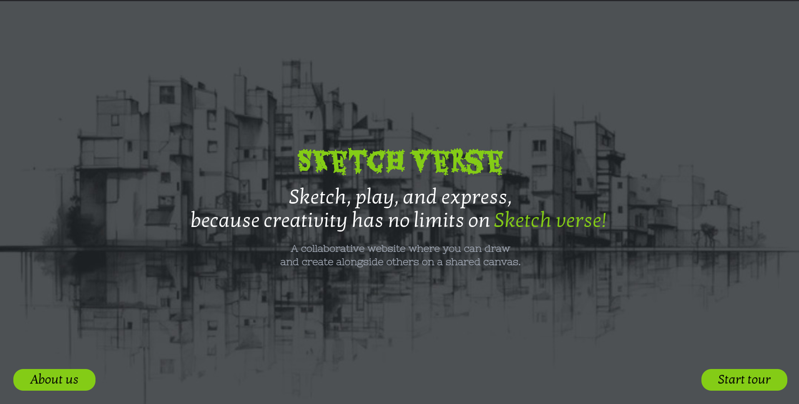

# Sketch Verse - A Multiplayer Drawing & Guessing Game



Welcome to **Sketch Verse**! This is a multiplayer game where players can draw and guess words. It features two main modes: drawing mode and jamming mode. The goal is to guess the word based on the drawing, earning points for correct guesses.

## Tech Stack
- **React.js** - Frontend for building a responsive and interactive user interface.
- **Tailwind CSS** - Utility-first CSS framework for fast UI development.
- **Express.js** - Backend server framework for handling requests and routing.
- **Socket.io** - Real-time communication between the client and server for the multiplayer game functionality.

## Getting Started

Follow the steps below to clone the repository and set up the project:

### 1. Clone the Repository
First, clone the repository to your local machine using Git.

```bash
git clone https://github.com/yourusername/sketch-verse.git
cd sketch-verse
```

### 2. Install Dependencies
Install the required packages for both the frontend and backend.

#### For the Frontend (React.js + Tailwind CSS):
Navigate to the **client** directory and install the necessary npm packages:

```bash
cd client
npm install
```

#### For the Backend (Express.js + Socket.io):
Navigate to the **server** directory and install the necessary npm packages:

```bash
cd ../server
npm install
```

### 3. Run the Project
To run the project, follow these steps:

#### Start the Backend (Express.js + Socket.io):
In the **server** directory, start the server:

```bash
cd server
npm start
```

This will run the server on the default port (usually `3000`).

#### Start the Frontend (React.js + Tailwind CSS):
In the **client** directory, start the React app:

```bash
cd ../client
npm start
```

This will launch the frontend application on the default port (usually `3000`).

### 4. Access the Game
Open your browser and go to `http://localhost:3000` to play the game!

## Features
- **Multiplayer Mode**: Play with up to 10 players and guess words based on drawings.
- **Drawing Mode**: Take turns drawing and guessing words.
- **Jamming Mode**: A more chaotic version of the game with randomized word selection.

## Contributing
If you'd like to contribute to Sketch Verse, feel free to fork the repository and submit pull requests. Please make sure to follow the coding guidelines.

### License
This project is licensed under the MIT License - see the [LICENSE](LICENSE) file for details.

